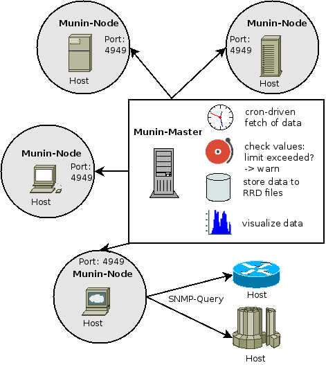

.. _architecture-index:

====================
Munin's Architecture
====================

.. _architecture-overview:

Overview
========

Munin has a master-nodes architecture.

Components
==========

Here we describe the components of Munin.
On page :ref:`Protocols <protocol-index>` we talk about the rules for interaction between them.

Munin-Master
^^^^^^^^^^^^

The master is responsible for all central Munin-related tasks.

It regularly connects to the various nodes, and then :ref:`synchronously <protocol-index>`
asks for the various metrics configuration and values and stores the data in `RRD <https://oss.oetiker.ch/rrdtool/>` files.

On the fly the values are checked against limits (that you may set)
and the Munin-Master will croak, if values go above or below the given thresholds.

Here we also generate the graphs, as this is a heavy task that needs some resources.
Recent versions of Munin use cgi-graphing to generate graphs only
when the user wants to see them.

.. toctree::
   :maxdepth: 2

   ../master/index.rst

Munin-Node
^^^^^^^^^^

The node is a small agent running on each monitored host. We can have
agent-less monitoring but this is a special case that will be addressed later.
On machines without native support for Perl scripting you can use `munin-c <https://github.com/munin-monitoring/munin-c>`_,
which is a C rewrite of munin node components. (Look for the details in the :ref:`munin-c chapter <munin-c>`.)

Note that an usual setup involves having a node running also on the master
host, in order to munin to monitor itself.

.. toctree::
   :maxdepth: 2

   ../node/index.rst

Munin-Plugin
^^^^^^^^^^^^

The munin plugin is a simple executable, which role is to gather one
set of facts about the local server (or fetching data from a remote machine via SNMP)

The plugin is called with the argument "config" to get metadata, and
with no arguments to get the values. These are mandatory arguments for each plugin.
We have some more standard arguments, which play a role in the process of automatic configuration.

.. toctree::
        :maxdepth: 2

        ../plugin/index.rst
        ../plugin/env.rst
        ../plugin/multigraphing.rst
        ../plugin/protocol-dirtyconfig.rst
        ../plugin/protocol-multigraph.rst
        ../plugin/snmp.rst
        ../plugin/use.rst
        ../plugin/writing-tips.rst
        ../plugin/writing.rst
        ../plugin/supersampling.rst

Relations
^^^^^^^^^

- Each Munin master may monitor one or more Munin nodes (1:n)
- More than one Munin master may monitor one or more Munin nodes (n:m)
    - Does this confuse lightly stupid plugins?
    - Is "multi-master" configurations tested, known and/or documented?
    - Does the Plugin-writing-howto describe how the plugin should behave if queried more often than in five minutes intervals and/or from different Munin masters?
- Each Munin node controls one or more plugins (1:n)
- Each plugin returns, when queried:
    - One or more general directives to control the plugin itself, with corresponding values
    - One or more data sources (fields) described by fieldname (1:n)
    - Each data source has one or more attributes (1:n), with corresponding values

Protocols
=========

.. toctree::
   :maxdepth: 2

   protocol.rst

Syntax
======

.. toctree::
   :maxdepth: 2

   syntax.rst

API
===

.. toctree::
   :maxdepth: 2

   api.rst
