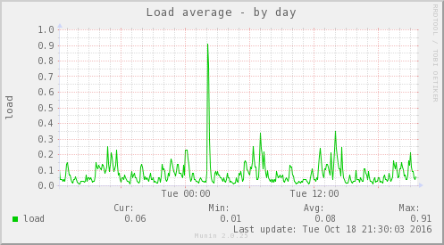
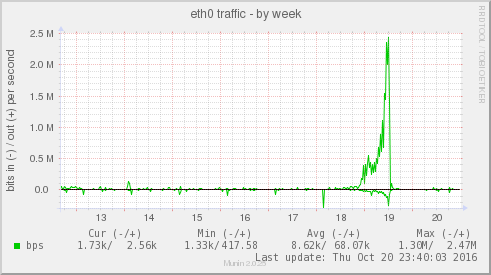

.. _howto-write-plugins:

============================
 How to write Munin Plugins
============================

.. index::
   pair: contributing; munin; documentation

Writing a Munin plugin is astoundingly simple.  If you know where the data is and know a minimum of scripting in perl/shell/awk/sed or something like that you can do it.

In way of explaining it all we'll write two plugins the simplest way.  Since I'm kind of old school I'll use shell and shell tools for these plugins.  You can do them completely in perl or any other language you like.

Load average plugin
===================

On Unix you can get a hosts load average from the command ``uptime``. However, on Linux the load average is also available from the file called ``/proc/loadavg``.  One less external command will make the plugin faster.

Getting a field value
---------------------

::

  $ cat /proc/loadavg
  0.05 0.07 0.14 1/74 30026

The file consists of numbers separated by only one space.  The Unix ``cut`` command should be good for that:

::

  $ cut -d' ' -f1  /proc/loadavg
  0.05

As easy as it gets.  One thing wrong here though: Munin calls the plugins every 5 minutes (this may change in the future).  The better value to report is not the first one but the second one.  In the man page for ``uptime`` you'll see this called the 5 minute load average.

Also, munin wants the value in a more structured form:

::

  # printf "load.value "; cut -d' ' -f2  /proc/loadavg
  load.value 0.06

Here the ``load`` is called the field or field name, ``value`` the attribute, and the number is of course the value. (See our :ref:`complete overview of Munin specific terminology <nomenclature>`).

That was the hard part of the plugin.  The rest is just book-keeping.

Munin plugin config command
---------------------------

For munin to know how to draw a graph of the reported numbers, it calls the plugin script with :ref:`config <plugin-config>` as the only argument.  A minimal output looks like this:

::

  graph_title Load average
  graph_vlabel load
  load.label load

The global attribute :ref:`graph_title <graph_title>` sets the title of the graph - in large lettering across the top. The other global attribute :ref:`graph_vlabel <graph_vlabel>` labels the vertical axis of the graph.  In addition load.
:ref:`label <fieldname.label>` provides a color coded legend for the graphed line provided by load. :ref:`value <fieldname.value>`.

Everything in a script
----------------------

The most trivial plugin is then this script:

::

  #!/bin/sh

  case $1 in
     config)
          cat <<'EOM'
  graph_title Load average
  graph_vlabel load
  load.label load
  EOM
          exit 0;;
  esac

  printf "load.value "
  cut -d' ' -f2  /proc/loadavg

Testing it:

::

  $ ./load
  load.value 0.08
  $ ./load config
  graph_title Load average
  graph_vlabel load
  load.label load

Place the plugin in ``/etc/munin/plugins``. To test it for real use :ref:`munin-run <munin-run>`.  This sets up the environment for the plugin exactly like it would be when run from the :ref:`munin-node <munin-node>` network service.

::

  # munin-run load
  load.value 0.08
  # munin-run load config
  graph_title Load average
  graph_vlabel load
  load.label load

Finishing touches
-----------------

There are a couple more things you can add to improve the plugin.  For example Munin supports more explanatory legends,  and the graph should be tweaked.  For instance, one may add these attributes to the :ref:`config <plugin-config>` output:

::

  graph_args --base 1000 -l 0
  graph_scale no
  graph_category system
  load.warning 10
  load.critical 120
  graph_info The load average of the machine describes how many processes are in the runqueue (scheduled to run "immediately").
  load.info Average load for the five minutes.

The values of :ref:`graph_args <graph_args>` are passed to the `graphing tool (rrd) <https://oss.oetiker.ch/rrdtool/doc/rrdgraph.en.html>`_ to instruct it about how to draw the graphs.

``--base`` is to make it scale the graph with a 1000 base (1000=1k 1000k=1M and so on.
If you give the base as 1024 as you might when measuring bytes then 1024=1k 1024k=1M and so on. Disks are usually measured in units of 1000 due to the industry standard for marketing disks that people have gotten used to).

The ``-l 0`` sets the lowest value to 0.  If all readings of a plugin were between 10 and 100 the lowest value on the graph might otherwise be set to 10.  On a graph showing readings in percent you might add ``--upper-limit 100`` (of course some percentage readings goes past 100%).

:ref:`graph_scale no <graph_scale>` makes munin (rrd) not scale the number.  Normally a reading of 1000 would be scaled to ``1k`` and 1000000 to ``1M`` (according to scales set with ``--base`` explained above).

Pick a suitable ``graph_category`` from the :ref:`list of well-known categories <plugin-graph-category>`.

The :ref:`.warning <fieldname.warning>` and :ref:`.critical <fieldname.critical>` attributes are used to issue status messages.  In the case of load average they're probably set statically by the plugin author.  A plugin may also examine the system on which it runs to determine good values for these.  The best way is for the plugin author provide defaults, and then code the plugin to get defaults from environment variables such as ``$warning`` and ``$critical``.

The values :ref:`graph_info <graph_info>` attribute and each of the :ref:`.info <fieldname.info>` field-attributes are added as text on the html page under the graphs.  They serve as legends for the graphs shown.  In the case of this plugin there is not much to say - in other cases, when presenting output from more complex systems (much) more explanation is in order.  Imagine writing for a person that knows Unix/networks/operating systems in general but not the specific sub-system the plugin measures in particular.

This results in a graph such as this:

The html load page looks like the `page <http://munin.ping.uio.no/ping.uio.no/knuth.ping.uio.no/load.html>`_  pointed to here.  There you can see the use of the info attributes as well.

Restarting munin-node
---------------------

The :ref:`munin-node <munin-node>` network service will not discover new plugins in the plugin directory until you restart it.

::

  # service munin-node reload
  Stopping Munin Node agents:                                [  OK  ]
  Starting Munin Node:                                       [  OK  ]

Now you can check the reading by telnet:

::

  # telnet localhost 4949
  Trying 127.0.0.1...
  Connected to localhost.
  Escape character is '^]'.
  # munin node at foo.example.com
  fetch load
  load.value 0.06
  .
  quit

And now Munin will find the plugin as well - and you should have a readable graph within 15-20 minutes.

Here is the real source for the load average plugin for different architectures:

* `Linux load plugin <https://raw.githubusercontent.com/munin-monitoring/munin/stable-2.0/plugins/node.d.linux/load.in>`_

* `FreeBSD load plugin <https://raw.githubusercontent.com/munin-monitoring/munin/stable-2.0/plugins/node.d.freebsd/load.in>`_

* `Solaris load plugin <https://raw.githubusercontent.com/munin-monitoring/munin/stable-2.0/plugins/node.d.sunos/load.in>`_

You will see that they observe some additional niceties that I've not described here.

Error handling in plugins
=========================

The unix way of communicating errors in such small programs is to set the exit code.  But just setting the exit code (exit 2, exit 3, exit 4) and not issuing a error message is not very friendly.  Therefore, if there is a execution error, such as not being able to open a file that the plugin should be able to access, please both give a error message and exit with a non-zero value.  In shell it goes like this:

::

  if [ ! -r /proc/loadavg ] ; then
     echo Cannot read /proc/loadavg >&2
     exit -1
  fi

In perl:

::

  open(LOAD,"</proc/loadavg") or die "Could not open /proc/loadavg for reading: $!\n";

.. _network-interface-plugin:

Network interface plugin
========================

This plugin demonstrates some additional points but it is much the same as the load plugin.  Firstly this plugin will make two curves in one.  This graph will show how many bytes pass over each network interface on the host it is run. In quite many Unixes you'll find these numbers in the output of ``/sbin/ifconfig``:

::

  $ /sbin/ifconfig
  eth1      Link encap:Ethernet  HWaddr 00:13:CE:63:45:B2
            inet addr:10.0.0.2  Bcast:10.0.0.255  Mask:255.255.255.0
            inet6 addr: fe80::213:ceff:fe63:45b2/64 Scope:Link
            UP BROADCAST RUNNING MULTICAST  MTU:1500  Metric:1
            RX packets:2610 errors:0 dropped:0 overruns:0 frame:0
            TX packets:3162 errors:0 dropped:0 overruns:0 carrier:42
            collisions:0 txqueuelen:1000
            RX bytes:817182918 (779.3 MiB)  TX bytes:2835962961 (2.6 GiB)
            Interrupt:18 Base address:0xc000 Memory:b0204000-b0204fff
  ...

As usual in Linux though you can also find these numbers in a file.  In this case it's ``/proc/net/dev``:

::

  Inter-| Receive                                                |  Transmit
  face  | bytes packets errs drop fifo frame compressed multicast|  bytes packets errs   drop fifo colls carrier compressed
    lo:22763978  191841    0    0    0     0          0         0 22763978  191841    0    0    0     0       0          0
    eth0:       0       0    0    0    0     0          0         0        0       0    0    0    0     0       0          0
    eth1:817283042    3242    0    0    0     0          0         0 2836088627    4372    0    0    0     0      42          0
    sit0:       0       0    0    0    0     0          0         0        0       0    0    0    0     0       0          0

This is food for awk.  For each interface we're interested in, it shows the interface name, received bytes and transmitted bytes. Awk usually uses whitespace as column separator, but this file uses "``:``" as well.  Fortunately we can adjust awk's column separator.

::

  $ awk -v interface="eth1" -F'[: \t]+' \
     '{ sub(/^ */,""); // Remove leading space
         if ($1 == interface) print "down.value "$2"\nup.value "$10;
      }' /proc/net/dev
  down.value 818579628
  up.value 2837327179

But there is one important difference: The load plugin reports a number that can simply be plotted on the Y axis.  These ethernet numbers will just continue to grow into the sky as long as the machine is up.  What we actually want to graph is the increase in the numbers between each sampling measured in bits (or bytes) per second.  Munin (rrd) will take the number and divide by the number of seconds between the samples (currently the sample interval is fixed at 5 minutes, or 300 seconds), so the "per second" part is taken care of.  The bytes to bits we'll get into in a second.  This is the appropriate :ref:`config <plugin-config>` output for the plugin thus far:

::

  graph_order down up
  graph_title eth1 traffic
  graph_args --base 1000
  graph_vlabel bits in (-) / out (+) per ${graph_period}
  down.label received
  down.type COUNTER

The data type :ref:`COUNTER <fieldname.type>` here says that the value is a counter that keeps increasing rather than a GAUGE which the load reading was. If you put this into a script and add a :ref:`config <plugin-config>` section you'll have a working plugin producing two curves in one graph.

But there is more:

::

  down.graph no
  down.cdef down,8,*
  up.label bps
  up.type COUNTER
  up.negative down
  up.cdef up,8,*

Here are two or three points. The :ref:`.cdef <fieldname.cdef>` thing takes care of multiplying by 8 to get from bytes (or bytes per second) which is what the file shows to bits (i.e., bits per second), which is the unit most humans use when they think about network speeds.

There is a munin policy that input and output to the same device should be graphed in the same graph, this we already do.  BUT, we want the output above the X axis and input below.  This is done by first disabling graphing of the input (downloaded) value, then using :ref:`up.negative down <fieldname.negative>`.  Instead of just negating the down value this keeps the sign and gives the down graph the same color as the up graph.  The values in the database are kept as normal, the whole thing is magicked by Munin while graphing.

The end result is this kind of graph:

Given a full set of info attributes (I've broken the first line to make it practical to read):

::

 graph_info This graph shows the traffic of the eth0 network interface. Please note
 that the traffic is shown in bits per second, not bytes. IMPORTANT: Since the
 data source for this plugin use 32bit counters, this plugin is really unreliable
 and unsuitable for most 100Mb (or faster) interfaces, where bursts are expected
 to exceed 50Mbps. This means that this plugin is usuitable for most production
 environments. To avoid this problem, use the ip_ plugin instead.

 up.info Traffic of the eth0 interface. Maximum speed is 1000Mbps

Then you end up with a `generated page like this <http://gauc.no-ip.org/munin/phx2.fedoraproject.org/x86-09.phx2.fedoraproject.org/if_wlan0.html>`_.

.. _validate-fieldnames:

Validate fieldnames
===================

There are some restrictions on the characters you can use in field names.  They are documented in :ref:`Notes on field names <notes-on-fieldnames>`.

Since Munin version 1.3.3 and 1.2.6 we have support modules for shell and perl plugins (see next sections).

Perl and sed
------------

These regular expressions should be applied to all field names to make them safe:

::

  s/^[^A-Za-z_]/_/
  s/[^A-Za-z0-9_]/_/g

Shell plugin
------------

::

  ...

  . "$MUNIN_LIBDIR/plugins/plugin.sh"

  ...

  fieldname="$(clean_fieldname "$dev")"

  ...

Perl plugin
-----------

::

  ...

  use Munin::Plugin;

  ...

  my $fieldname=clean_fieldname($dev);

  ...

Going on
========

The `plugin documentation <http://munin-monitoring.org/wiki/plugins>`_ should have all the information you need. I suggest the next thing you read about plugins is :ref:`Best Practices <plugin-bcp>` which should tell you all you need to know to get nice graphs in as few tries as possible. If planning to write a plugin as a shell script, please read `Shell Plugins <http://munin-monitoring.org/wiki/PluginShell>`_. If your plugin does not work like you think it should, try :ref:`Debugging Plugins <debugging-plugins>`. If you want to get the plugin autoconfigured on install and such take a look at page :ref:`PluginConcise <plugin-concise>`.

See also
========

 * :ref:`Concise guide to plugin authoring <plugin-concise>`
 * :ref:`Debugging Plugins <debugging-plugins>`
 * :ref:`Global plugin attributes <plugin_attributes_global>`
 * :ref:`Datasource-specific plugin attributes <plugin_attributes_data>`
 * :ref:`Multi-graph plugins <plugin-multigraphing>`
 * `Shell Plugins <http://munin-monitoring.org/wiki/PluginShell>`_
 * `Perl plugins <http://munin-monitoring.org/wiki/PerlPlugins>`_

