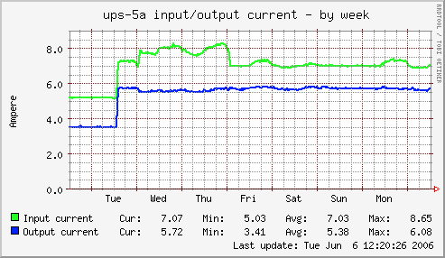
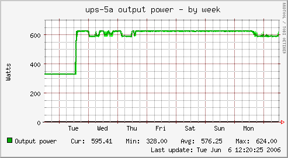

.. _example-plugin-aggregate:
.. index::
   single: Aggregating munin plugins
   pair: plugin; aggregate

==============================
 Graph aggregation by example
==============================

This example covers creating aggregate graphs. The configuration reads
the current and power from two UPSes (i.e. two hosts with two plugins
each) and then creates one virtual host with two virtual plugins; one
for current and one for power.

Plugins involved
================

The example uses a plugin for monitoring UPSes through SNMP, where the
UPS address and the different aspects are defined through symlinks.
The two UPSes, called "ups-5a" and "ups-5b", are monitored with
respect to "current" and "power". Thus, the affected plugins are
called as:

::

 snmp_ups_ups-5a_current
 snmp_ups_ups-5b_current
 snmp_ups_ups-5a_power
 snmp_ups_ups-5b_power

The original plugin name is actually "snmp_ups\_\_" - note the "two"
underscores at the end. The plugin is then symlinked to the given host
name(s) (e.g. ups-5a) and what we want to monitor (e.g. power). Let's
just take one closer look at one of them:

::

 snmp_ups_ups-5a_power
 -------- ------ -----
     |       |     |
     |       |     `--- The function we want to monitor
     |       `--------- The node name of the UPS
     `----------------- The plugin

Extract from munin.conf
=======================

The following extract from /etc/munin/munin.conf is explained in
detail, step by step, below the configuration.

::

  1 [UPS;ups-5a]
  2        address 127.0.0.1 # localhost fetches data
  3
  4 [UPS;ups-5b]
  5        address 127.0.0.1 # localhost fetches data
  6
  7 [UPS;Aggregated]
  8         update no
  9         contacts no
 10
 11         snmp_ups_current.update no
 12         snmp_ups_current.graph_args --base 1000 -l 0
 13         snmp_ups_current.graph_category UPS
 14         snmp_ups_current.graph_title Aggregated input/output current
 15         snmp_ups_current.graph_vlabel Ampere
 16         snmp_ups_current.inputtotal.label Input current
 17         snmp_ups_current.outputtotal.label Output current
 18         snmp_ups_current.graph_order inputtotal outputtotal
 19         snmp_ups_current.inputtotal.sum \
 20                         ups-5a:snmp_ups_ups-5a_current.inputcurrent \
 21                         ups-5b:snmp_ups_ups-5b_current.inputcurrent
 22         snmp_ups_current.outputtotal.sum \
 23                         ups-5a:snmp_ups_ups-5a_current.outputcurrent \
 24                         ups-5b:snmp_ups_ups-5b_current.outputcurrent
 25
 26         snmp_ups_power.update no
 27         snmp_ups_power.graph_args --base 1000 -l 0
 28         snmp_ups_power.graph_category UPS
 29         snmp_ups_power.graph_title Aggregated output power
 30         snmp_ups_power.graph_vlabel Watts
 31         snmp_ups_power.output.label Output power
 32         snmp_ups_power.graph_order output
 33         snmp_ups_power.output.sum \
 34                         ups-5a:snmp_ups_ups-5a_power.outputpower \
 35                         ups-5b:snmp_ups_ups-5b_power.outputpower

Explanations, per line
======================

* 1 - 2: The SNMP-based plugin for the UPS known as "ups-5a" is
  defined. The group name is "UPS" and the node name is "ups-5a". The
  plugin is run from localhost.

* 4 - 5: The SNMP-based plugin for the UPS known as "ups-5b" is
  defined. The group name is "UPS" and the node name is "ups-5b". The
  plugin is run from localhost.

* 7: The group and "virtual node name" for the aggregated graphs are
  defined. The group name is "UPS" and the virtual node name is
  "Aggregated".

* 8: Make sure that Munin (specifically, "munin-update") does not try
  to actively gather information for this node.

* 9: Tell "munin-limits" not to send alerts if any limit is breached.

The above lines (1 - 9) have now established the fundament for three
different graph pages; one for each of the two UPSes and one for the
aggregate graphs.

* 11 - 15: Define the basic information for the virtual plugin for
  aggregated current. Note that "snmp_ups_current" is the virtual
  plugin's name.

* 16 - 17: Simultaneously define and label "two" values to be graphed
  in the virtual plugin: "inputtotal" and "outputtotal".

* 18: Order the values.

* 19 - 21: Calculate the value for "inputtotal" by reading the
  "inputcurrent" values from each of the two UPSes.

Let's take a closer look at the components

::

 snmp_ups_current.inputtotal.sum \
 ---------------- ---------- ---
         |             |      |
         |             |      `-- The sum mechanism
         |             `--------- One of this virtual plugin's values
         `----------------------- The name of the virtual plugin

::

 ups-5a:snmp_ups_ups-5a_current.inputcurrent \
 ups-5b:snmp_ups_ups-5b_current.inputcurrent
 ------ ----------------------- ------------
    |               |                 |
    |               |                 `------ The "inputcurrent" value from the real plugin
    |               `------------------------ The real plugin's name (symlink)
    `---------------------------------------- The host name from which to seek information

* 22 - 24: Similarly for "outputtotal".

* 26 - 35: Like the above, but for power instead. Note that this
  virtual plugin graphs only "one" value, and as such, only "one"
  "sum" mechanism is used.

Result graphs
=============

The graphs below show one of the UPSes, and the aggregated values. The
graphs used are by week, because they had a nice dip in the beginning
of the graphing period :-)

Source graphs for one of the UPSes:

Aggregate graphs:

.. image:: aggregate/aggregate_current.png

.. image:: aggregate/aggregate_power.png

Summary
=======

We have now, in addition to the two real UPS nodes "ups-5a" and
"ups-5b" (lines 1 - 5), created one virtual host named "Aggregated"
(line 7) with two virtual plugins: "snmp_ups_current" (lines 11 - 24)
and "snmp_ups_power" (lines 26 - 35).

The "snmp_ups_current" virtual plugin outputs two field names:
"inputtotal" (lines 16 and 19 - 21) and "outputtotal" (lines 17 and
22 - 24), while the "snmp_ups_power" virtual plugin outputs only one
field name, namely "output" (lines 31 - 35).

Further reading
===============

 * [wiki:Using_SNMP_plugins Using SNMP plugins]
 * [wiki:munin.conf munin.conf] directives explained
