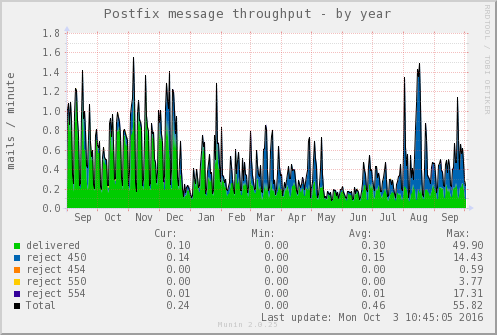
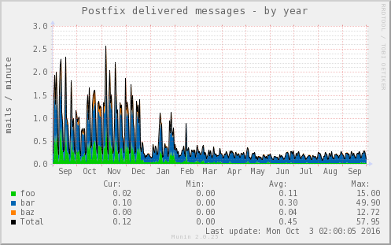

.. _example-aggregated-stack:
.. index::
   single: Aggregating munin plugins
   pair: data source; loan
   pair: graph; stacked
   pair: plugin; aggregate
   pair: plugin; virtual
   pair: virtual; node

===================================
 Graph aggregation stacking example
===================================

Here we show how to create a stacked graph with data sources from multiple nodes.

.. _config_postfix_mailstats:

Plugin involved
================

The example uses a plugin that monitors Postfix message throughput.

Let's first look at its config output:

::

 # munin-run postfix_mailstats config
 graph_title Postfix message throughput
 graph_args --base 1000 -l 0
 graph_vlabel mails / ${graph_period}
 graph_scale  no
 graph_total  Total
 graph_category postfix
 graph_period minute
 delivered.label delivered
 delivered.type DERIVE
 delivered.draw AREA
 delivered.min 0
 r450.label reject 450
 r450.type DERIVE
 r450.draw STACK
 r450.min 0
 r454.label reject 454
 r454.type DERIVE
 r454.draw STACK
 r454.min 0
 r550.label reject 550
 r550.type DERIVE
 r550.draw STACK
 r550.min 0
 r554.label reject 554
 r554.type DERIVE
 r554.draw STACK
 r554.min 0

Extract from munin.conf
=======================

The following extract from :ref:`munin.conf <munin.conf>` is explained in
detail, step by step, below the configuration.

::

  1 [foo.example.com]
  2       address ..
  3
  4 [bar.example.com]
  5       address ..
  6
  7 [baz.example.com]
  8       address ..
  9
 10 [aggregates.example.com]
 11       update no
 12       contacts no
 13
 14 # This graph stacks the number of postfix delivered mails / minute
 15 # from the nodes foo.example.com, bar.example.com and baz.example.com
 16
 17       total_mailstats.update no
 18       total_mailstats.graph_args --base 1000 -l 0
 19       total_mailstats.graph_category postfix
 20       total_mailstats.graph_period minute
 21       total_mailstats.graph_title Postfix delivered messages
 22       total_mailstats.graph_vlabel mails / ${graph_period}
 23       total_mailstats.graph_scale  no
 24       total_mailstats.graph_total  Total
 25       total_mailstats.total_delivered.label not_used
 26       total_mailstats.total_delivered.type DERIVE
 27       total_mailstats.total_delivered.draw AREA
 28       total_mailstats.total_delivered.min 0
 29       total_mailstats.total_delivered.stack \
 30           foo=Infrastruktur;foo.example.com:postfix_mailstats.delivered \
 31           bar=Infrastruktur;bar.example.com:postfix_mailstats.delivered \
 32           baz=Infrastruktur;baz.example.com:postfix_mailstats.delivered

Explanations, per line
======================

* 1 - 2: Configuration of Node foo.example.com.

* 4 - 5: Configuration of Node bar.example.com.

* 7 - 8: Configuration of Node bar.example.com.

* 10: Define the name of the virtual node.
  The name of a node group can optionally be added here,
  e.g. "[Virtual; aggregates.example.com]".

* 11: Make sure that ``munin-update`` does not try
  to actively gather information for this node.

* 12: Tell ``munin-limits`` not to send alerts if any limit is breached.

The above lines (1 - 12) have now established the fundament for four
nodes in the Munin tree; three *real* nodes delivering data on connect
by ``munin-update`` and one *virtual* node for the aggregate graphs.

* 17: No fetch from node should be done for this virtual plugin
  (which is named implicitly herewith to "total_mailstats").

* 18 - 24: Define the virtual plugin's config in the same way as
  set for its *ancestor* plugin ``postfix_mailstats`` (see output in section :ref:`Plugin involved <config_postfix_mailstats>`  above).
  We set a different graph title though, as we graph only field ``delivered`` here.

* 25: The virtual plugin's field itself will not show up in the graph
  but only the fields loaned from the real nodes. Therefore this
  hint that will be shown in the graphs legend.

* 26: Default type is ``GAUGE`` but we have type ``DERIVE`` here.
  So the field's type has to be declared explicitly.

* 27: Values should be drawn as AREA and not as LINE for
  better recognition of small values.

* 28: Cut off negative values which can arise at arithmetic overflow for data type ``DERIVE``.
  `See manual of rrdgraph <https://oss.oetiker.ch/rrdtool/doc/rrdcreate.en.html#IDERIVE>`_

* 29: This directive is the key that opens the door for
  loaning data sources from other nodes and plugins.
  As we choose option ``stack`` here, the values of the
  hereafter referenced data sources will show up
  stacked on each other in the graph.

* 30 - 33: Declare the virtual data fields as reference to
  the original data source in node foo, bar and baz.
  The string on the left side of the expression will be the name
  of the data field shown in the graph of this virtual plugin.
  Hint: If you need to reference a node that is member of a node group,
  then enter its name with the leading group name like "Group;node.name".

Result graph
=============

Source graph for bar.example.com:

Aggregate graph:

Further reading
===============

 * :ref:`Graph aggregation by example <example-plugin-aggregate>`
 * :ref:`munin.conf <munin.conf>` directives explained

