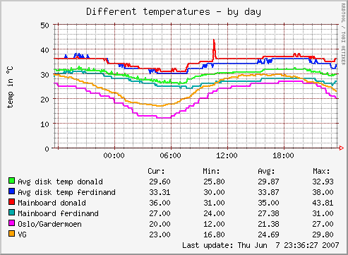

.. _example-aggregation-combined:
.. index::
   single: Aggregating munin plugins
   pair: data source; loan
   pair: plugin; aggregate
   pair: plugin; virtual
   pair: field; cdef
   pair: field; sum
   pair: virtual; node

========================================
 Loaning data combined with sum and cdef
========================================

Different arithmetics may be combined to create the graphs you want.
Insert appropriate lines in the Munin Master configuration file :ref:`munin.conf <munin.conf>`.

The first example shows how to create a graph by loaning data from other sources, then adding an average value from five other data sources using :ref:`sum <fieldname.sum>` and :ref:`cdef <fieldname.cdef>`. The data in the example uses the following types of temperature measurements

 #. Disk temperatures from S.M.A.R.T. readouts from servers called **donald** and **ferdinand** (lines 06, 07)

 #. Motherboard temperatures from ``sensors`` readouts from the same servers (lines 08, 09)

 #. weather.com reading from Oslo airport, Gardermoen (line 10)

 #. A regular temperature sensor (line 11)

Line 06 is only a placeholder, which will be populated later by using :ref:`sum <fieldname.sum>` and :ref:`cdef <fieldname.cdef>`.

::

  01     temperatures.update no
  02     temperatures.graph_args --base 1000 -l 0
  03     temperatures.graph_category Sensors
  04     temperatures.graph_title Different temperatures
  05     temperatures.graph_order \
  06             donald_disk \
  07             ferdinand_disk=ferdinand.example.com:hddtemp_smartctl.sda \
  08             donald_mb=donald.example.com:sensors_temp.temp1 \
  09             ferdinand_mb=ferdinand.example.com:sensors_temp.temp1 \
  10             gardermoen=ferdinand.example.com:temperatures.ENGM \
  11             VG=donald.example.com:munintemp.vg
  12     temperatures.donald_disk.sum \
  13             donald.example.com:hddtemp_smartctl.sda \
  14             donald.example.com:hddtemp_smartctl.sdb \
  15             donald.example.com:hddtemp_smartctl.sdc \
  16             donald.example.com:hddtemp_smartctl.sdd \
  17             donald.example.com:hddtemp_smartctl.sde
  18     temperatures.donald_disk.cdef donald_disk,5,/
  19     temperatures.VG.label VG
  20     temperatures.donald_mb.label Mainboard donald
  21     temperatures.ferdinand_mb.label Mainboard ferdinand
  22     temperatures.gardermoen.label Oslo/Gardermoen
  23     temperatures.ferdinand_disk.label Avg disk temp ferdinand
  24     temperatures.donald_disk.label Avg disk temp donald

Explanations, per line
======================

* 01 - 04: The usual headers
* 05 - 11: Defines the graph order, where 5 out of 6 data sources are borrowed elsewhere
  Note: Line 11 defines a not yet "populated" data source.
* 12 - 17: Sums 5 other data sources (temperatures from 5 disks),
  into the "donald_disk" data source
* 18: Divides the "donald_disk" data source by the number of sources (5)
  to create an average
* 19 - 24: Labels to make it all look neat

This produces a pretty graph like this, to show the relation between outside temperatures and disk/mainboard temperatures:

Further reading
===============

 * :ref:`Graph aggregation by example <example-plugin-aggregate>`
 * :ref:`Graph aggregation stacking example <example-aggregated-stack>`
 * :ref:`munin.conf <munin.conf>` directives explained

