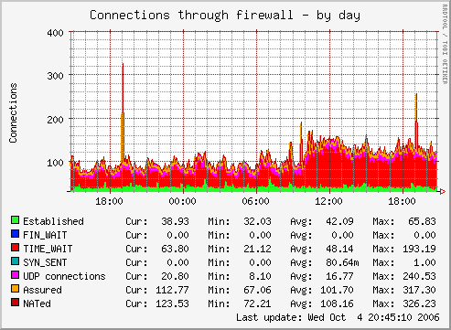
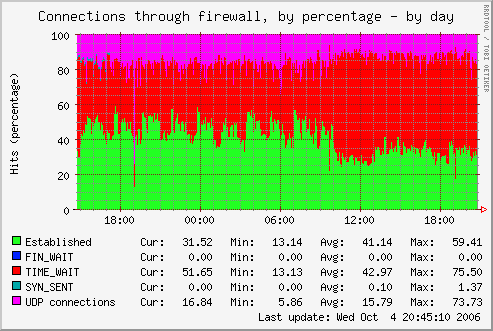

.. _percent-graph:
.. index::
   pair: graph; percentage distribution
   pair: data source; loan
   pair: plugin; virtual
   single: cdef;

===================================================
Virtual plugin to graph distribution by percentages
===================================================

Why?
====

In the FAQ it's explained how to create a percentage graph with two data sources by using a somewhat heavy :ref:`cdef <fieldname.cdef>` trick. Graphing more than two data sources using that method would

1. require CDEF incantations from somewhere beyond hell
2. require Munin to perform the same calculations in CDEF over and over again

Of course, an alternative is to create a wildcard version of the plugin; one that gives the numbers and one that gives the ratio(s). This will, however, dump the load on the :ref:`munin-node <munin-node>`.

Creating graphs showing distribution by percentage is often required, while lots of the Munin plugins deal with occurrences and hits. For example, the numbers of hits and misses in a reverse proxy are indeed interesting to see the throughput, while the hits/misses ratio is interesting to see how efficient the caching is.

(Yes, I realise this example was a bad one as it has only two data sources. Bear with me ;-)

How?
====

By combining loaning data from other data sources, and massaging them with CDEF, Munin is able to create another *view* of existing graphs not currently graphing in percentage shares by itself, showing the data distributed by percentage.

The :ref:`munin.conf <master-conf-node-directives>` extract below is based on the ``fw_conntrack`` plugin, which has as much as 5 relevant data sources. The sections are commented below through line numbers.

Sample munin.conf extract
=========================

::

 01 [foo.example.com]
 02
 03         [...]
 04
 05         conntrack_percent.update no
 06         conntrack_percent.graph_category network
 07         conntrack_percent.graph_args --base 1000 -l 0 -u 100 -r
 08         conntrack_percent.graph_scale no
 09         conntrack_percent.graph_title Connections through firewall, by percentage
 10         conntrack_percent.graph_vlabel Connections (percentage)
 11
 12        conntrack_percent.graph_order \
 13                established=fw_conntrack.established \
 14                fin_wait=fw_conntrack.fin_wait \
 15                time_wait=fw_conntrack.time_wait \
 16                syn_sent=fw_conntrack.syn_sent \
 17                udp=fw_conntrack.udp \
 18                total=fw_conntrack.nated \
 19                in_established=fw_conntrack.nated \
 20                in_fin_wait=fw_conntrack.nated \
 21                in_time_wait=fw_conntrack.nated \
 22                in_syn_sent=fw_conntrack.nated \
 23                in_udp=fw_conntrack.nated
 24
 25        conntrack_percent.established.graph no
 26        conntrack_percent.fin_wait.graph no
 27        conntrack_percent.time_wait.graph no
 28        conntrack_percent.syn_sent.graph no
 29        conntrack_percent.udp.graph no
 30
 31        conntrack_percent.total.graph no
 32        conntrack_percent.total.cdef established,fin_wait,time_wait,syn_sent,udp,0.00001,+,+,+,+,+
 33
 34        conntrack_percent.in_established.cdef established,total,/,100,*
 35        conntrack_percent.in_established.label Established
 36        conntrack_percent.in_established.draw AREA
 37
 38        conntrack_percent.in_fin_wait.cdef fin_wait,total,/,100,*
 39        conntrack_percent.in_fin_wait.label FIN_WAIT
 40        conntrack_percent.in_fin_wait.draw STACK
 41
 42        conntrack_percent.in_time_wait.cdef time_wait,total,/,100,*
 43        conntrack_percent.in_time_wait.label TIME_WAIT
 44        conntrack_percent.in_time_wait.draw STACK
 45
 46        conntrack_percent.in_syn_sent.cdef syn_sent,total,/,100,*
 47        conntrack_percent.in_syn_sent.label SYN_SENT
 48        conntrack_percent.in_syn_sent.draw STACK
 49
 50        conntrack_percent.in_udp.cdef udp,total,/,100,*
 51        conntrack_percent.in_udp.label UDP connections
 52        conntrack_percent.in_udp.draw STACK

The config explained
====================

* 01 - A standard definition for a node.

* 03 - Any other (required) information for defining a node, like ``address``, has been omitted for readability.

* 05 - This virtual plugin should not be run by :ref:`munin-update <munin-update>`.

* 07 - Set min and max values for the graphs, and also include ``-r`` which tells RRD that the graph shall not exceed 100% even if the summarized values (because of rounding errors) do.

* 08 - No auto-scaling.

* 09-10 - The graph title and its vertical title.

* 12-23 - Use :ref:`graph_order <graph_order>` to *loan* data from other graphs, and to define not yet existing field names. Note that the first seven field names (11-17) loan data from corresponding graphs to be used later, while the rest (18-25) just need some dummy data for the definitions.

* 25-29 - Make sure Munin won't try to graph the base data.

* 31 - Munin shouldn't try to do anything funny with the total value either, as this value is only used internally when creating the graph.

* 32 - Here, the fieldname 'total' is defined as the sum of the 5 original data sources (``in_*``). We add the value 0.00001 to the value if all the original data sources should yield the value '0', in which case Munin will crash and burn.

* 34 - Define the value for the first field name, derived as a percentage share of the total sum.

* 35 - The field name needs a label. This should correspond to the original graph (in this case, fw_conntrack).

* 36 - Finally for this field name, define it as :ref:`draw type <fieldname.draw>` AREA.

* 38-40 - Like the above, but use STACK instead. Repeat until all 5 data sources are covered.

When the configuration is complete, Munin will be able to create percentage graphs from your already existing data, i.e. the new graph(s) should appear immediately.

Sample graphs
=============

The plugin's own graph:

The resulting graph of the above munin.conf section, loaning data from the plugin and manipulating them:

Note that the data sources ``assured`` and ``nated`` differ from the other data sources the ``fw_conntrack`` plugin monitors. Consequently they are excluded from the percentage graph.

Further reading
===============

 * `Loaning data from other graphs <http://munin-monitoring.org/wiki/LoaningData>`_
 * :ref:`Graph aggregation by example <example-plugin-aggregate>`
 * :ref:`munin.conf <munin.conf>` directives explained

