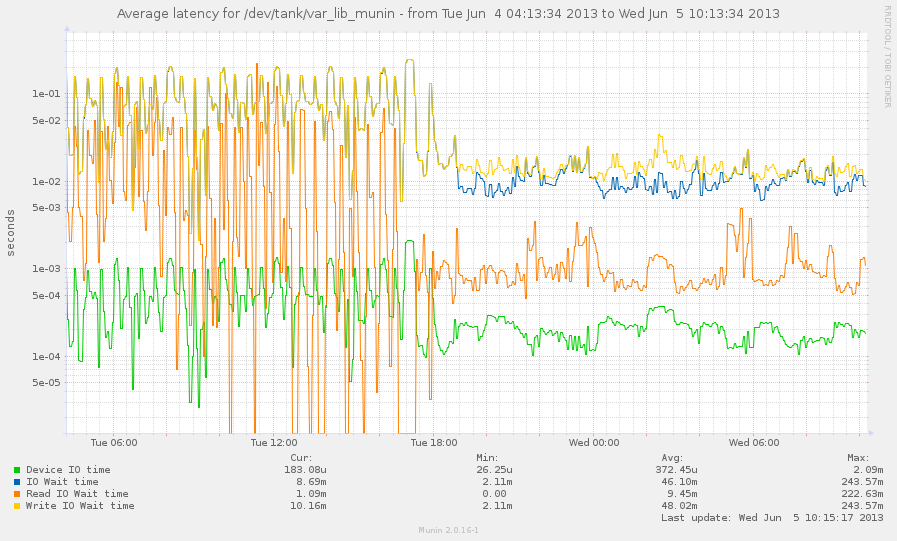

.. _munin-master-rrdcached:

=========================================
 Scaling the munin master with rrdcached
=========================================

When the master grows big, and has a lot of nodes, there is a risk of
disk IO becoming a bottleneck.

To reduce this disk IO, you can use the RRD Cache Daemon.

This will spool RRD changes in a queue, and flush changes on demand,
and periodically. This will replace lots of random writes with a much
smaller amount of sequential writes.

The effects on disk IO can be quite dramatic.

This example is a graph of a munin master with 400 nodes. Even with
storage on mirrored SSDs, the effect of adding rrdcached is an immediate
reduction in IO, and especially on wait times.

Configuring rrdcached
=====================

Parameters
----------

RRDCached writes the spool data every 5 minutes by default. This is the
same as the munin master. To have an effect, change the flushing
intervals to allow more data to be spooled. Use the following
parameters, and tune to your liking:

+---------+-----------------------------------------------------+
| -w 1800 | Wait 30 minutes before writing data                 |
+---------+-----------------------------------------------------+
| -z 1800 | Delay writes by a random factor of up to 30 minutes |
|         | (this should be equal to, or lower than, "-w")      |
+---------+-----------------------------------------------------+
| -f 3600 | Flush all data every hour                           |
+---------+-----------------------------------------------------+

Example
-------

Create a directory for the rrdcached journal, and have the "munin"
user own it. (in this example: /var/lib/munin/rrdcached-journal).

Set up a separate RRDCached instance, run by the munin user. The
following command starts an RRDCached instance, and can be added to
/etc/rc.local.

.. code-block:: bash

  sudo -u munin /usr/bin/rrdcached \
    -p /run/munin/rrdcached.pid \
    -B -b /var/lib/munin/ \
    -F -j /var/lib/munin/rrdcached-journal/ \
    -m 0660 -l unix:/run/munin/rrdcached.sock \
    -w 1800 -z 1800 -f 3600

Note: While testing, add "-g" to the command line to prevent rrdcached
from forking into the background.

The munin grapher also needs write access to this socket, in order for
it to tell the RRDCached to flush data needed for graphing. If you run
munin with CGI graphing, you will need to give the web server access.
For a common setup, run the following command, as root, after starting
rrdcached:

.. code-block:: bash

 chgrp www-data /run/munin/rrdcached.sock

Recommended: If you have systemd or upstart installed, use the examples below.

* :ref:`example-rrdcached-upstart`
* :ref:`example-rrdcached-systemd`

Configuring munin to use rrdcached
==================================

To enable rrdcached on the munin master, you will need to set the
"rrdcached_socket" line in /etc/munin/munin.conf

::

  rrdcached_socket /run/munin/rrdcached.sock

Is it working?
==============

If all goes well, you should see the following:

Munin logging
-------------

There should be no messages regarding rrdcached in
/var/log/munin/munin-update.log.

On failure to connect, there will be log lines like:

::

 2012/06/26 18:56:12 [WARN] RRDCached feature ignored: rrdcached socket not writable

…and you should then check for permissions problems.

RRDCached spool
---------------

The rrdcached spool file should be in
/var/lib/munin/rrdcached-journal/, and it should grow for each run of
munin-update until it hits the flush time. The file looks like:

::

  /var/lib/munin/rrdcached-journal/rrd.journal.1340869388.141124

For a munin master with 200 nodes, this could well grow to 100MiB,
depending on the number of plugins, and the spool file time
parameters.

Monitoring rrdcached
====================

Munin plugins to monitor ``rrdcached`` are in the distribution. You can download them also from our repository `plugin for stable 2.0 <https://github.com/munin-monitoring/munin/blob/stable-2.0/plugins/node.d.debug/rrdcached.in>`_ and `plugin from master branch <https://github.com/munin-monitoring/munin/blob/master/plugins/node.d.debug/rrdcached>`_ You need to :ref:`configure your munin-node <plugin-conf.d>` to run this plugin as group rrdcached.
