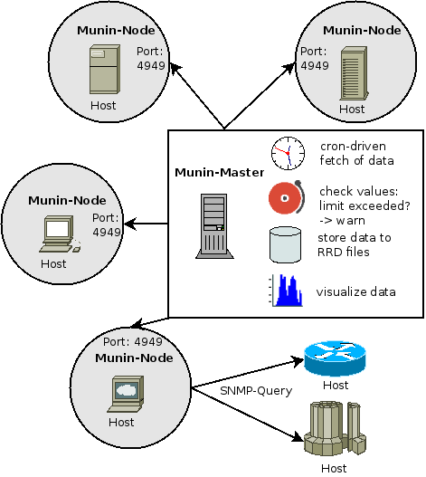

Getting Started
================

Nomenclature
------------

Please refer to the Nomenclature part to understand the terms used in this guide.

Installation
------------

Before you can use Munin you need to install it, of course. It is possible that
Munin is already installed at your site, either because it was included in your
operating system distribution or because the system administrator already
installed it. If that is the case, you should obtain information from the
operating system documentation or your system administrator about how to access
Munin.

If you are installing Munin yourself, then refer to Install Chapter for
instructions on installation, and return to this guide when the installation is
complete. Be sure to follow closely the section about setting up the
appropriate configuration files.

All the tutorial will assume a Debian installation, so all the commands are
suited to the Debian package management system. As the one in Ubuntu is mostly
the same, examples should work unchanged. For RPM-based systems, the equivalent
yum command is left as an exercise to the reader, but should not be very hard
to get.

We cannot speak about every other OS, but any UNIX-like have been reported to
work. Your safest best should still to stick to a supported OS if you don't
feel adventurous.

Also, you should need a dedicated server for the master role, as it mostly
requires root access. Again, it is not required, but safety, and ability to
copy/paste the samples, advise you to stick to these guidelines.

Architectural Fundamentals
--------------------------

Munin has a master-nodes architecture. 

------------
Munin-Master
------------

The master is responsible for all central Munin-related tasks.

It regularly connects to the various nodes, and then synchronously [#]_ 
asks for the various metrics configuration and values and stores the data in RRD files.

On the fly the values are checked against limits (that you may set) 
and the Munin-Master will croak, if values go above or below the given thresholds.

Here we also generate the graphs, as this is a heavy task that needs some resources. 
Recent versions of Munin use cgi-graphing to generate graphs only 
when the user want's to see them.

----------
Munin-Node
----------

The node is a small agent running on each monitored host. We can have
agent-less monitoring but this is a special case that will be addressed later.

Note that an usual setup involves having a node running also on the master
host, in order to munin to monitor itself.

-------------
Fetching Data
-------------

.. [#] Poller-based monitoring infrastructure 

.. graphviz::

   digraph  {
        "master" -> "node1";
        "master" -> "node2";
        "master" -> "node3";
   }

and also - where needed - per async

.. graphviz::

   digraph  {
        "master" -> async1 -> "node1";
        "master" -> "node3";
   }

Adding a Node
-------------

Thanks to the plug-and-play architecture of Munin, this is very easy. You
obviously have to install the node part on the host you want to monitor.

::

  $ apt-get install munin-node

This will install the node, some default plugins and launch it.

As the node runs as the root user in order to run plugins as any needed user,
it now only listens on localhost as a security measure. You have to edit
munin-node.conf in order to listen to the network, and add the master's IP on
the authorized list.
