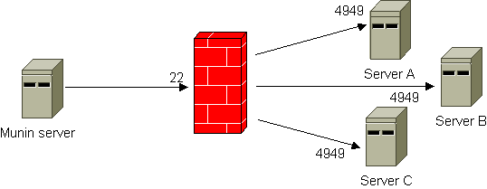
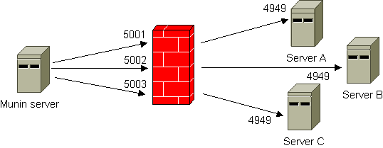

.. _unreachable-index:

==================================
Monitoring the "unreachable" hosts
==================================

There are a number of situations where you'd like to run munin-node
on hosts not directly available to the Munin server.
This article describes a few scenarios and different alternatives
to set up monitoring. Monitoring hosts behind a non-routing server.

In this scenario, a \*nix server sits between the Munin server and
one or more Munin nodes. The server in-between reaches both the
Munin server and the Munin node, but the Munin server does not
reach the Munin node or vice versa.

To enable for Munin monitoring, there are several approaches,
but mainly either using SSH tunneling or "bouncing" via the in-between server.

.. _ssh-tunneling:

SSH tunneling
-------------

The illustration below shows the principle. By using
SSH tunneling only one SSH connection is required,
even if you need to reach several hosts on "the other side".
The Munin server listens to different ports on the localhost interface.
A `configuration example <http://munin-monitoring.org/wiki/MuninConfigurationNetworkTunneling>`_
is included. Note that there is also a
`FAQ entry on using SSH <http://munin-monitoring.org/wiki/faq#Q:HowcanIuseanSSHtunneltoconnecttoanode>`_
that contains very useful information.

.. _xinetd-bouncing:

Bouncing
--------

This workaround uses netcat and inetd/xinetd to forward the queries
from the Munin server. All incoming connections to defined ports
are automatically forwarded to the Munin node using netcat.

The in-between server ("bouncer") assigns and opens different TCP ports pointing to each of the Munin nodes you need to reach. This is really quite identical to regular port forwarding (see :ref:`next section below <port-forwarding>`).

Comparing this method to :ref:`SSH tunneling <ssh-tunneling>`, using (x)inetd does not require a login account on the bouncer, while the downside is that the access control may be weaker and you might need to open lots of TCP ports.

From ``/etc/services`` on the bouncer:

::

 munin            4949/tcp
 munin-server-a   5001/tcp
 munin-server-b   5002/tcp
 munin-server-c   5003/tcp

If you use ``inetd``, entries like these must exist in ``/etc/inetd.conf`` on the bouncer:

::

 munin-server-a   stream  tcp     nowait  root  /usr/bin/nc /usr/bin/nc -w 30 server-a munin
 munin-server-b   stream  tcp     nowait  root  /usr/bin/nc /usr/bin/nc -w 30 server-b munin
 munin-server-c   stream  tcp     nowait  root  /usr/bin/nc /usr/bin/nc -w 30 server-c munin

If you use ``xinetd``, the ``/etc/xinetd.d/`` directory on the bouncer needs one file each for the different servers (Server-A, Server-B and Server-C). For easier recognition, it's a good idea to prefix the files with for example "munin-". A sample *munin-server-a* file looks like this (note that the file name equals the "service" directive, and that the destination server and port are given as server_args):

::

 service munin-server-a
 {
        disable = no
        socket_type     = stream
        wait            = no
        user            = root
        protocol        = tcp
        server          = /usr/bin/nc
        server_args     = -w 30 server-a munin
 }

The node definitions in :ref:`munin.conf <munin.conf>` on Munin Master must be configured accordingly:

::

 [Server-A]
   address bouncer
   port 5001
   use_node_name yes

 [Server-B]
   address bouncer
   port 5002
   use_node_name yes

 [Server-C]
   address bouncer
   port 5003
   use_node_name yes

.. note::

  In this scenario your Munin Nodes have to allow connections (in :ref:`munin-node.conf <munin-node.conf>`) **from the IP address of the bouncer** and not from the Munin Master as usual.

.. _port-forwarding:

Behind a NAT device
-------------------

Monitoring hosts behind a NAT device (e.g. DSL router or firewall)

If you have one or more Munin nodes on the "inside" of a NAT device,
port forwarding is probably the easiest way to do it.
Configuring port forwarding on all kinds of network units and
firewall flavours is way beyond the scope of the Munin documentation,
but the illustration below show the principle.

The port mapping links TCP port 5001 to server A, port 5002 to server B, and port 5003 to server C.

After you have successfully configured this, the node definitions in :ref:`munin.conf <munin.conf>` on Munin Master must be configured accordingly:

::

 [Server-A]
   address bouncer
   port 5001
   use_node_name yes

 [Server-B]
   address bouncer
   port 5002
   use_node_name yes

 [Server-C]
   address bouncer
   port 5003
   use_node_name yes

Note that if the NAT device is a \*nix system, you may also use the two approaches described above.
