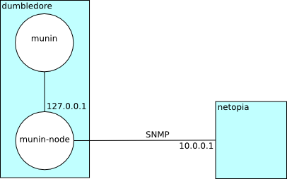

.. _tutorial-snmp:

===================
Using SNMP plugins
===================

(Cribbed from an e-mail written by Rune Nordbøe Skilingstad)

The easy way to configure SNMP plugins in Munin is to use :ref:`munin-node-configure <munin-node-configure>`.

In this setup, both munin and munin-node runs on the server "dumbledore",
and we also want to monitor the router "netopia" using SNMP plugins.
The setup is shown below:

On the node you want to use as an SNMP gateway ("dumbledore"),
run the configure script against your SNMP-enabled device ("netopia").

::

 dumbledore:~# munin-node-configure --shell --snmp netopia
 ln -s /usr/share/munin/plugins/snmp__if_ /etc/munin/plugins/snmp_netopia_if_1
 ln -s /usr/share/munin/plugins/snmp__if_err_ /etc/munin/plugins/snmp_netopia_if_err_1

Note that :ref:`munin-node-configure <munin-node-configure>` also accepts other switches,
namely ``--snmpversion`` and ``--snmpcommunity``:

::

 munin-node-configure --shell --snmp <host|cidr> --snmpversion <ver> --snmpcommunity <comm>

This process will check each plugin in your Munin plugin directory for the
:ref:`magic markers <magic-markers>` ``family=snmpauto`` and ``capabilities=snmpconf``,
and then run each of these plugins against the given host or CIDR network.

Cut and paste the suggested ``ln`` commands and restart your node.

The node will then present multiple virtual nodes:

::

 dumbledore:~# telnet localhost 4949
 Trying 127.0.0.1...
 Connected to localhost.
 Escape character is '^]'.
 # munin node at dumbledore
 nodes
 netopia
 dumbledore
 .
 list netopia
 snmp_netopia_if_1
 snmp_netopia_if_err_1

On your master server (where you gather the information into rrd files)
you add this virtual node to your :ref:`munin.conf <munin.conf>`
(example contains both real node and the virtual one -- both
with the same ``address`` line)

::

 [dumbledore]
    address 127.0.0.1
    use_node_name yes

 [netopia]
    address 127.0.0.1
    use_node_name no

Next time :ref:`munin-cron <munin-cron>` runs, the virtual node should start
showing up in your Munin website.

You cannot easily set the SNMP community if it is different from
the default ``public``.

Recommended solution:

::

 # munin-node-configure --snmp your.host.domain.tld --snmpcommunity "seacrat community"

Note that the community strings are not automatically saved anywhere.
You will have to store them yourself to a file under ``/etc/munin/plugin-conf.d/``.
This file should not be world readable.

Example file ``/etc/munin/plugin-conf.d/snmp_communities``:

::

 [snmp_netopia_*]
 env.community seacrat community

 [snmp_some.other.device_*]
 env.community frnpeng pbzzhavgl

Always provide your community name unquoted. In fact, if you
do quote it, it will tread the quote as part of the community name,
and that will usually not work. Just note that any prefix or trailing
white space is stripped out, so you **cannot** currently configure a
community name with a prefix or trailing white space.

To probe SNMP hosts over IPv6, use ``--snmpdomain udp6`` with ``munin-node-configure``. To have the SNMP plugins poll devices over IPv6, set the ``domain`` environment variable to ``udp6`` in the plugin configuration file. Other transports are available; see the Net::SNMP perldoc for more options.
